# data viz key
Michelle Evans  
`r format(Sys.Date())`  


# Week 6 : Data Visualization

This document contains the answers to the assignments from Week 6: Data Visualization of Ecology 8030.


```r
library(tidyverse)
```

```
## Loading tidyverse: ggplot2
## Loading tidyverse: tibble
## Loading tidyverse: tidyr
## Loading tidyverse: readr
## Loading tidyverse: purrr
## Loading tidyverse: dplyr
```

```
## Conflicts with tidy packages ----------------------------------------------
```

```
## filter(): dplyr, stats
## lag():    dplyr, stats
```

```r
library(ggthemes)
```


## 1 : Basic Queries

We didn't cover SQL in class, so don't worry about this one.


\clearpage

## 2 : Mass vs Metabolism


```r
size_mr_data <- data.frame(
  body_mass = c(32000, 37800, 347000, 4200, 196500, 100000, 4290, 
    32000, 65000, 69125, 9600, 133300, 150000, 407000, 115000, 
    67000,325000, 21500, 58588, 65320, 85000, 135000, 20500, 1613,
    1618),
  metabolic_rate = c(49.984, 51.981, 306.770, 10.075, 230.073, 
    148.949, 11.966, 46.414, 123.287, 106.663, 20.619, 180.150, 
    200.830, 224.779, 148.940, 112.430, 286.847, 46.347, 142.863, 
    106.670, 119.660, 104.150, 33.165, 4.900, 4.865))
```

### 2.1 A graph of body mass vs. metabolic rate


```r
# plain old graph
ggplot(data=size_mr_data) + #call ggplot and dataframe
  geom_point(aes(x=body_mass, y=metabolic_rate)) + #plot points
  labs(x="Body Mass", y ="Metabolic Rate") #add axis labels
```

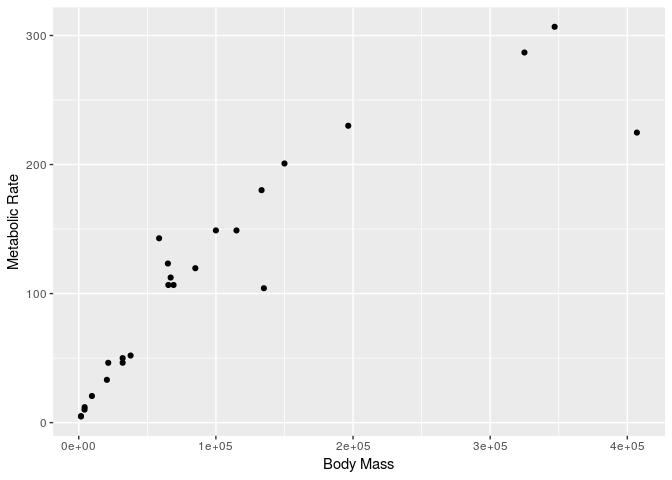<!-- -->

```r
#spruce it up tufte style (must have package ggthemes loaded)
ggplot(data=size_mr_data) + #call ggplot and dataframe
  geom_point(aes(x=body_mass, y=metabolic_rate)) + #plot points
  labs(x="Body Mass", y ="Metabolic Rate") + #add axis labels 
  theme_tufte() + #tufte theme
  ggtitle("Plot 1.1. Metabolic Rate Increases with Body Mass") + #title
  theme(plot.title = element_text(size=24)) #adjust title size
```

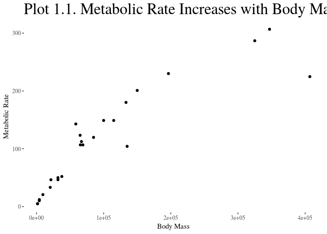<!-- -->

### 2.2 A graph of log(body mass) vs. log(metabolic rate)


```r
ggplot(data=size_mr_data) + 
  geom_point(aes(x=log(body_mass), y=log(metabolic_rate))) +
  labs(x="Log(Body Mass)", y ="Log(Metabolic Rate)") 
```

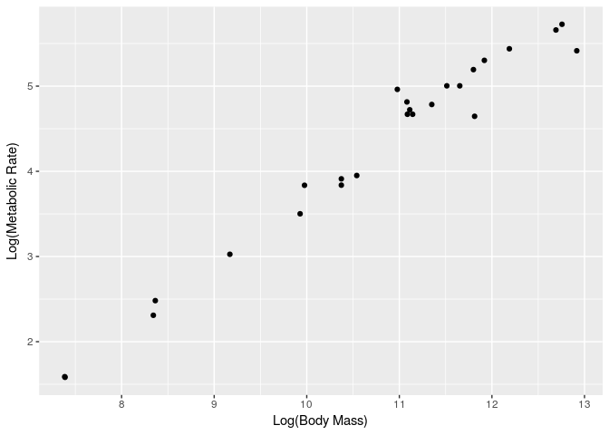<!-- -->

### 2.3 A graph of body mass vs. metabolic rate, with logarithmically scaled axes (this is different from number 2), and the point size set to 5


```r
ggplot(data=size_mr_data) + 
  geom_point(aes(x=body_mass, y=metabolic_rate), size=5) +
  labs(x="Log(Body Mass)", y ="Log(Metabolic Rate)") +
  scale_x_log10() + #scale x axis
  scale_y_log10() #scale y axis
```

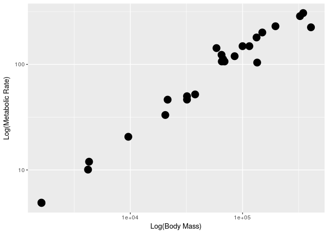<!-- -->

## 3. Adult vs New born size

### Load and Format the Data


```r
mammals <- read.csv("http://esapubs.org/archive/ecol/E084/093/Mammal_lifehistories_v2.txt", 
                    sep="\t", #tab seperated
                    nrows=1440, #only want 1440 rows
                    na.strings = c("-999", "-999.00")) #drop NAs

#check out head of dataframe
head(mammals)
```

```
##          order         family       Genus       species mass.g.
## 1 Artiodactyla Antilocapridae Antilocapra     americana   45375
## 2 Artiodactyla        Bovidae       Addax nasomaculatus  182375
## 3 Artiodactyla        Bovidae   Aepyceros      melampus   41480
## 4 Artiodactyla        Bovidae  Alcelaphus    buselaphus  150000
## 5 Artiodactyla        Bovidae  Ammodorcas       clarkei   28500
## 6 Artiodactyla        Bovidae  Ammotragus        lervia   55500
##   gestation.mo. newborn.g. weaning.mo. wean.mass.g. AFR.mo. max..life.mo.
## 1          8.13    3246.36        3.00         8900   13.53           142
## 2          9.39    5480.00        6.50           NA   27.27           308
## 3          6.35    5093.00        5.63        15900   16.66           213
## 4          7.90   10166.67        6.50           NA   23.02           240
## 5          6.80         NA          NA           NA      NA            NA
## 6          5.08    3810.00        4.00           NA   14.89           251
##   litter.size litters.year              refs
## 1        1.85         1.00  1,2,6,9,23,26,27
## 2        1.00         0.99      1,2,17,23,26
## 3        1.00         0.95     1,2,8,9,23,29
## 4        1.00           NA         1,2,17,23
## 5        1.00           NA               1,2
## 6        1.37         2.00 1,2,9,11,17,23,29
```

```r
#also column names
colnames(mammals)
```

```
##  [1] "order"         "family"        "Genus"         "species"      
##  [5] "mass.g."       "gestation.mo." "newborn.g."    "weaning.mo."  
##  [9] "wean.mass.g."  "AFR.mo."       "max..life.mo." "litter.size"  
## [13] "litters.year"  "refs"
```

### 3.1 Adult vs. Newborn Mass


```r
base3 <- ggplot(data=mammals) +
  geom_point(aes(x=mass.g., y=newborn.g.)) + 
  labs(x="Adult Mass (g)", y= "Newborn Mass (g)") +
  theme_bw() #closer to base theme
```

Note the warning message regarding the NAs in the dataframe.

### 3.2 Adult vs. Newborn Mass w/ Log-Scale Axes


```r
ggplot(data=mammals) +
  geom_point(aes(x=mass.g., y=newborn.g.)) + 
  labs(x="Adult Mass (g)", y= "Newborn Mass (g)") + #axis labels
  theme_bw() + 
  scale_x_log10() + #log scale
  scale_y_log10()  #log scale#
```

```
## Warning: Removed 624 rows containing missing values (geom_point).
```

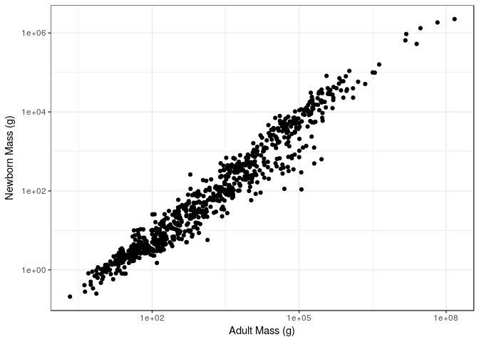<!-- -->

### 3.3 Add color by Order


```r
ggplot(data=mammals) +
  geom_point(aes(x=mass.g., y=newborn.g., color=order)) + #add color in aes
  labs(x="Adult Mass (g)", y= "Newborn Mass (g)") + #axis labels
  theme_bw() + 
  scale_x_log10() + #log scale
  scale_y_log10() #log scale
```

```
## Warning: Removed 624 rows containing missing values (geom_point).
```

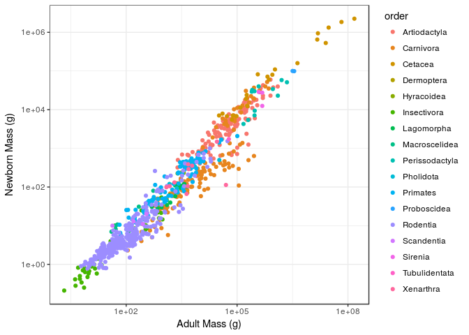<!-- -->

### 3.4 Facet Wrap by Order


```r
ggplot(data=mammals) +
  geom_point(aes(x=mass.g., y=newborn.g.)) + #add color in aes
  labs(x="Adult Mass (g)", y= "Newborn Mass (g)") + #axis labels
  theme_bw() + 
  scale_x_log10() + #log scale
  scale_y_log10() + #log scale
  facet_wrap(~order) #facet wrap by order
```

```
## Warning: Removed 624 rows containing missing values (geom_point).
```

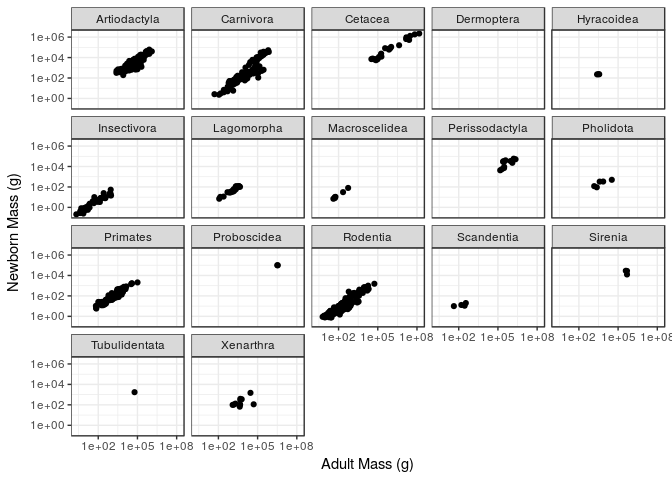<!-- -->

### 3.5 Add Smooth Regression Line


```r
ggplot(data=mammals) +
  geom_point(aes(x=mass.g., y=newborn.g.)) + #add color in aes
  labs(x="Adult Mass (g)", y= "Newborn Mass (g)") + #axis labels
  theme_bw() + 
  scale_x_log10() + #log scale
  scale_y_log10() + #log scale
  facet_wrap(~order) + #facet wrap by order
  geom_smooth(method="lm", aes(x=mass.g., y=newborn.g.))
```

```
## Warning: Removed 624 rows containing non-finite values (stat_smooth).
```

```
## Warning in qt((1 - level)/2, df): NaNs produced
```

```
## Warning: Removed 624 rows containing missing values (geom_point).
```

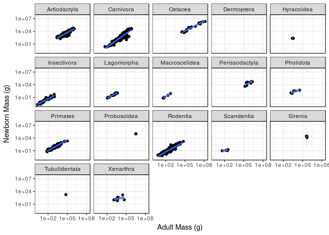<!-- -->

Remember you can also name a plot as an object, and then add things to that "base" plot.

## 4. Sexual Dimorphism Exploration


```r
birds <- read.csv("http://www.esapubs.org/archive/ecol/E088/096/avian_ssd_jan07.txt", 
                  sep="\t",
                  na.strings = c("-999", "-999.00", "-999.0"))
colnames(birds) #check out column names
```

```
##  [1] "Family"           "Species_number"   "Species_name"    
##  [4] "English_name"     "Subspecies"       "M_mass"          
##  [7] "M_mass_N"         "F_mass"           "F_mass_N"        
## [10] "unsexed_mass"     "unsexed_mass_N"   "M_wing"          
## [13] "M_wing_N"         "F_wing"           "F_wing_N"        
## [16] "Unsexed_wing"     "Unsexed_wing_N"   "M_tarsus"        
## [19] "M_tarsus_N"       "F_tarsus"         "F_tarsus_N"      
## [22] "Unsexed_tarsus"   "Unsexed_tarsus_N" "M_bill"          
## [25] "M_bill_N"         "F_bill"           "F_bill_N"        
## [28] "Unsexed_bill"     "Unsexed_bill_N"   "M_tail"          
## [31] "M_tail_N"         "F_tail"           "F_tail_N"        
## [34] "Unsexed_tail"     "Unsexed_tail_N"   "Clutch_size"     
## [37] "Egg_mass"         "Mating_System"    "Display"         
## [40] "Resource"         "References"       "X"               
## [43] "X.1"              "X.2"
```

### 4.1 Histogram


```r
ggplot(data=birds) + 
  geom_histogram(aes(x=F_mass)) + 
  labs(x="Female Mass (g)")
```

```
## `stat_bin()` using `bins = 30`. Pick better value with `binwidth`.
```

```
## Warning: Removed 1095 rows containing non-finite values (stat_bin).
```

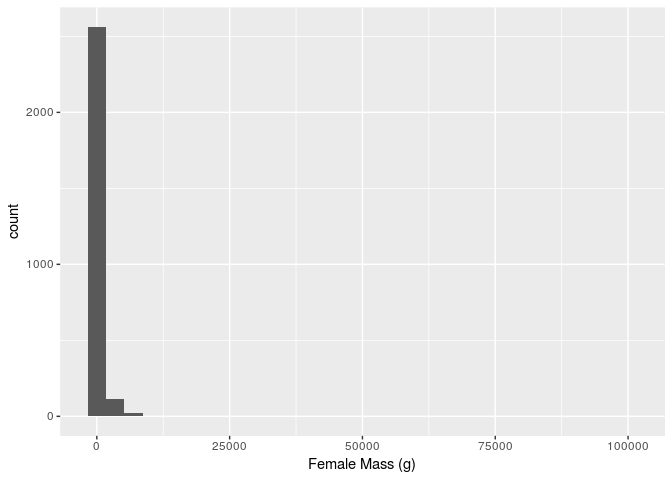<!-- -->

### 4.2 Log Histogram


```r
ggplot(data=birds) + 
  geom_histogram(aes(x=log(F_mass)), fill="dodgerblue") + #dodger blue is WAAAY better than blue
  labs(x="Female Mass (g)")
```

```
## `stat_bin()` using `bins = 30`. Pick better value with `binwidth`.
```

```
## Warning: Removed 1095 rows containing non-finite values (stat_bin).
```

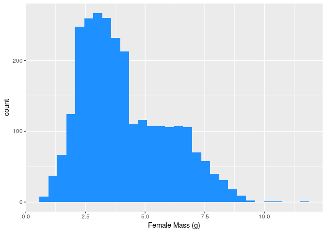<!-- -->

### 4.3 Male & Female Distribution


```r
ggplot(data=birds) + 
  geom_histogram(aes(x=log(F_mass)), fill="blue", alpha=0.3) + # add alpha for transparency
  labs(x="Mass (g)") + 
  geom_histogram(aes(x=log(M_mass)), fill="red", alpha=0.3)
```

```
## `stat_bin()` using `bins = 30`. Pick better value with `binwidth`.
```

```
## Warning: Removed 1095 rows containing non-finite values (stat_bin).
```

```
## `stat_bin()` using `bins = 30`. Pick better value with `binwidth`.
```

```
## Warning: Removed 979 rows containing non-finite values (stat_bin).
```

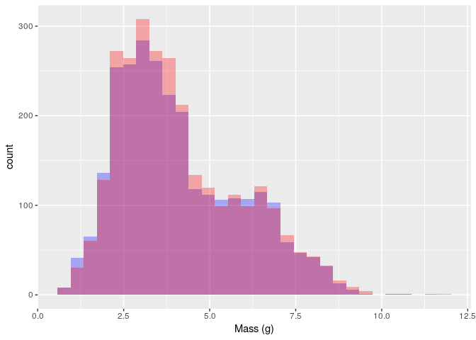<!-- -->

### 4.4 Facet Wrap


```r
ggplot(data=birds) + 
  geom_histogram(aes(x=log(F_mass)), alpha=0.3) + # add alpha for transparency
  labs(x="Mass (g)") + 
  geom_histogram(aes(x=log(M_mass)),alpha=0.3) + 
  facet_wrap(~Family)
```

```
## `stat_bin()` using `bins = 30`. Pick better value with `binwidth`.
```

```
## Warning: Removed 1095 rows containing non-finite values (stat_bin).
```

```
## `stat_bin()` using `bins = 30`. Pick better value with `binwidth`.
```

```
## Warning: Removed 979 rows containing non-finite values (stat_bin).
```

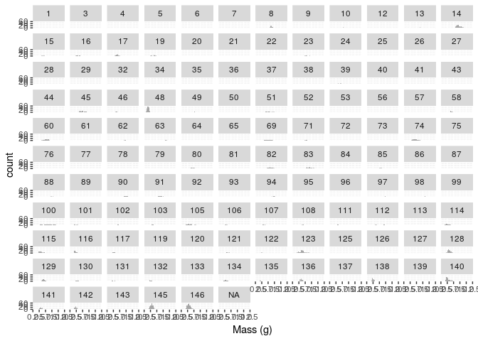<!-- -->

### 4.5 Wing Size


```r
ggplot(data=birds) + 
  geom_histogram(aes(x=Unsexed_wing)) + 
  labs(x="Wing Size") + 
  facet_wrap(~Family)
```

```
## `stat_bin()` using `bins = 30`. Pick better value with `binwidth`.
```

```
## Warning: Removed 3685 rows containing non-finite values (stat_bin).
```

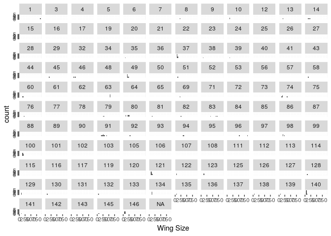<!-- -->

## 5. Sexual Dimorphism

### 5.1 Select Large Families


```r
#this code selects families of birds with more than 25 species in the dataframe
large_n_families <- birds %>%
   filter(!is.na(M_mass), !is.na(F_mass)) %>%
   group_by(Family) %>%
   summarize(num_species = n()) %>%
   filter(num_species>25)

#inner join with original dataset to subset those with more than 25 species
birdFamilies <- inner_join(birds, large_n_families, by="Family")

#plot male and female mass from large families
ggplot(data=birdFamilies) + 
  geom_histogram(aes(x=log(F_mass)), fill="blue", alpha=0.3) + # add alpha for transparency
  labs(x="Mass (g)") + 
  geom_histogram(aes(x=log(M_mass)), fill="red", alpha=0.3) +
  facet_wrap(~Family)
```

```
## `stat_bin()` using `bins = 30`. Pick better value with `binwidth`.
```

```
## Warning: Removed 819 rows containing non-finite values (stat_bin).
```

```
## `stat_bin()` using `bins = 30`. Pick better value with `binwidth`.
```

```
## Warning: Removed 717 rows containing non-finite values (stat_bin).
```

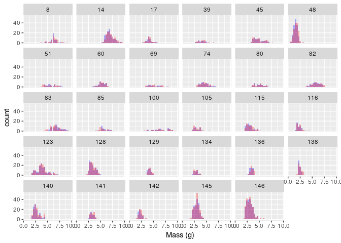<!-- -->

### 5.2 Calculate Difference in Mass between Male and Female


```r
#calculate difference using mutate
birdFamilies <- birdFamilies %>%
  mutate(massDiff=(log(F_mass) - log(M_mass))/log(F_mass))

#plot in a single histogram
ggplot(data=birdFamilies) + 
  geom_histogram(aes(x=massDiff)) + 
  labs(x="Relative Mass") +
  geom_vline(xintercept = 0)
```

```
## `stat_bin()` using `bins = 30`. Pick better value with `binwidth`.
```

```
## Warning: Removed 855 rows containing non-finite values (stat_bin).
```

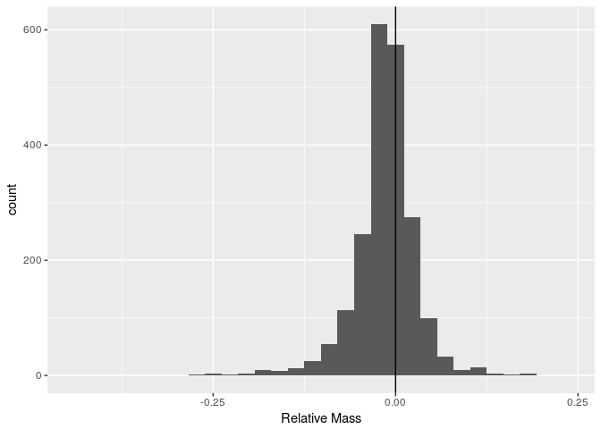<!-- -->

Note that to get it the same as the result online, you need to take the log difference.

### 5.3 Histogram per Family


```r
ggplot(data=birdFamilies) + 
  geom_histogram(aes(x=massDiff)) + 
  labs(x="Relative Mass") + 
  geom_vline(xintercept = 0) +
  facet_wrap(~Family)
```

```
## `stat_bin()` using `bins = 30`. Pick better value with `binwidth`.
```

```
## Warning: Removed 855 rows containing non-finite values (stat_bin).
```

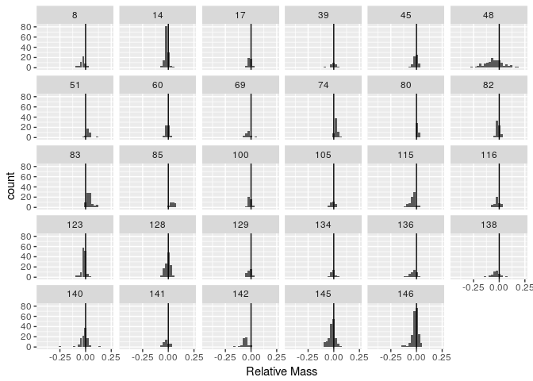<!-- -->

# Cool Thing I Learned this Week

The thing I learned this week was `facet-wrap`, which seems to be a much easier way to quickly visualize factors in data than seperately plotting each one in a for loop or apply statement (which is how I normally go about it in base R).

I also found a package called [`emoGG`](https://github.com/dill/emoGG) that allows you to plot emojis on ggplot charts!

Here it is plotting egg mass against clutch size:


```r
library(devtools)
install_github("dill/emoGG")
```

```
## Skipping install of 'emoGG' from a github remote, the SHA1 (84d3c75f) has not changed since last install.
##   Use `force = TRUE` to force installation
```

```r
library(emoGG)

birdPlotdata <- birdFamilies %>%
  filter(!is.na(Egg_mass), !is.na(Clutch_size)) %>%
  filter(Family>=140) #limit families for simplicity

emoji_search("bird") #search for bird emojis
```

```
##               emoji  code    keyword
## 765         chicken 1f414       bird
## 768      baby_chick 1f424       bird
## 774  hatching_chick 1f423       bird
## 778   hatched_chick 1f425       bird
## 779            bird 1f426     animal
## 780            bird 1f426     nature
## 781            bird 1f426        fly
## 782            bird 1f426      tweet
## 783            bird 1f426     spring
## 1207    poultry_leg 1f357       bird
## 2736              b 1f171 red-square
## 2737              b 1f171   alphabet
## 2738              b 1f171     letter
```

```r
ggplot(data=birdPlotdata, aes(x=Egg_mass, y=Clutch_size)) +
  geom_emoji(emoji="1f423") + #hatching chick emojis
  facet_wrap(~Family) +
  labs(x="Egg mass (g)", y = "Clutch Size") +
  theme_dark() #dark theme so you can see chicks
```

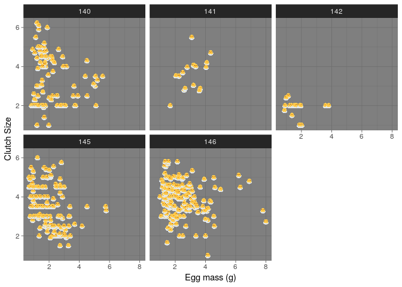<!-- -->


